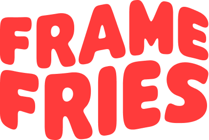

<p align="center">
  
</p>

<h1 align="center">
  Frame Fries 3D illustration agency website
</h1>

Please visit [framefries.com](https://framefries.com).

## 📚 Resources

This software relies on dependencies for better productivity, carefully picked considering usability, performance and popularity. Here are the most important documentations to refer to:

| Package | Purpose |
| --- | --- |
| [Histoire](https://histoire.dev) | Components sandbox & docs. |
| [SvelteKit](https://kit.svelte.dev) | Application framework. |
| [TailwindCSS](https://tailwindcss.com) | Utility-first CSS framework. |

## Run locally

```sh
# clone repo and set current directory
git clone git@github.com:noclat/framefries.com.git <project-name>
cd <project-name>

# create local environment variables file and populate it
cp .env.example .env

# install top-level dependencies
npm install

# start local server
npm run dev
```

New commit automatically deploys on GitHub pages.